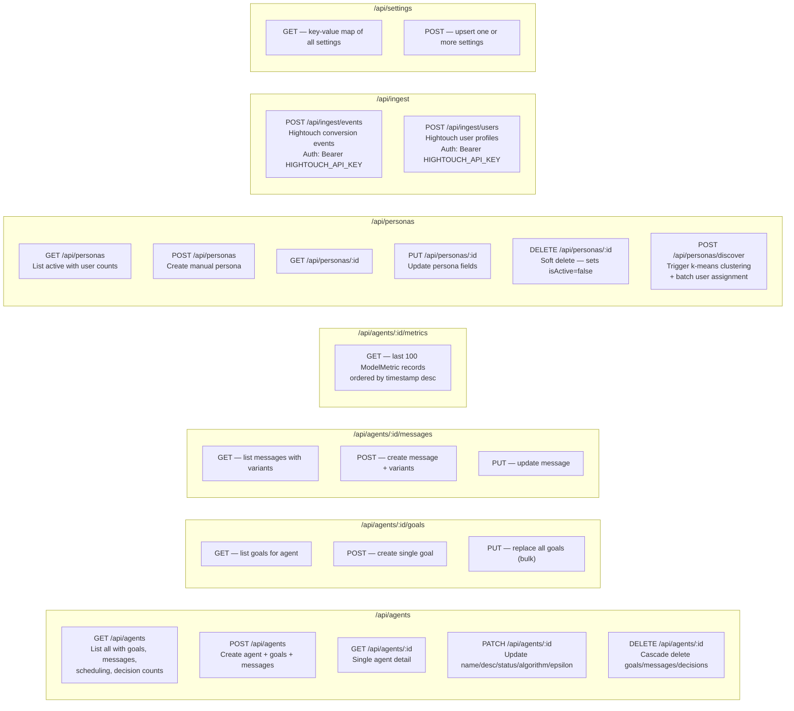

# API Routes

All REST endpoints in `src/app/api/`.



## Request / Response Shapes

### POST /api/agents
```typescript
// Request
{
  name: string
  description?: string
  algorithm?: "thompson" | "epsilon_greedy" | "contextual"
  epsilon?: number
  goals?: Array<{
    eventName: string
    tier: "best" | "very_good" | "good" | "bad" | "very_bad" | "worst"
    valueWeight?: number
    weightMode?: "fixed" | "property"
    weightProperty?: string
    weightDefault?: number
    description?: string
  }>
  messages?: Array<{
    name: string
    channel: "push" | "email" | "sms"
    brazeCampaignId?: string
    testedVariables?: string[]
    variants?: Array<{
      name: string
      subject?: string
      body?: string
      cta?: string
      title?: string
      deeplink?: string
    }>
  }>
}

// Response: Agent object with nested goals, messages, schedulingRule
```

### POST /api/ingest/events
```typescript
// Headers: Authorization: Bearer <HIGHTOUCH_API_KEY>
// Request
{
  events: Array<{
    externalId: string       // matches User.externalId
    name: string             // e.g. "plan_started"
    timestamp: string        // ISO 8601
    properties?: Record<string, unknown>
  }>
}

// Response
{ processed: number, matched: number, errors: string[] }
```

### POST /api/ingest/users
```typescript
// Headers: Authorization: Bearer <HIGHTOUCH_API_KEY>
// Request
{
  users: Array<{
    externalId: string
    attributes?: Record<string, unknown>
  }>
}

// Response
{ updated: number, errors: string[] }
```

### POST /api/personas/discover
```typescript
// Request
{
  minK?: number          // default 3
  maxK?: number          // default 15
  minInteractions?: number  // default 20 — minimum decisions to include user
}

// Response
{
  personas: Persona[]
  usersAssigned: number
  silhouetteScore: number
}
```

### GET /api/settings
```typescript
// Response
{
  BRAZE_API_KEY: string
  BRAZE_REST_URL: string
  BRAZE_ANDROID_APP_ID: string
  BRAZE_IOS_APP_ID: string
  BRAZE_WEB_APP_ID: string
  BRAZE_APP_GROUP_ID: string
  // ...any other stored keys
}
```

## Authentication

| Route group | Auth method |
|-------------|-------------|
| `/api/ingest/*` | `Authorization: Bearer <HIGHTOUCH_API_KEY>` env var |
| All others | None (internal / assumed network-secured) |
