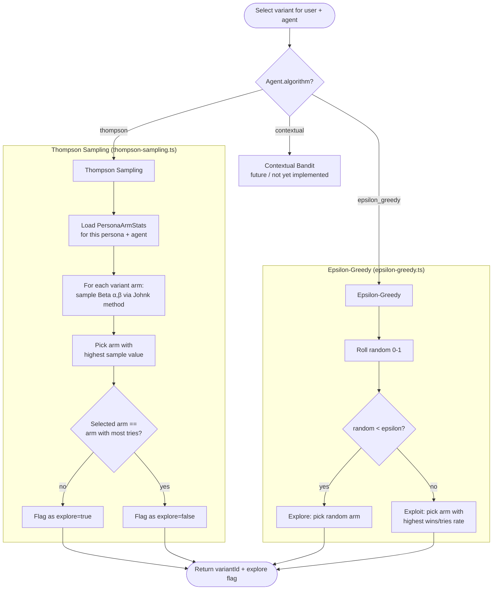
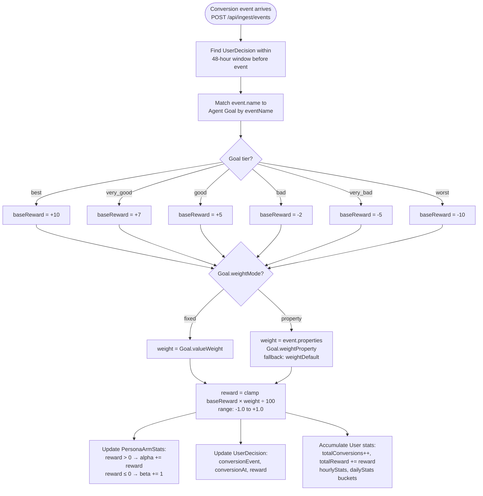
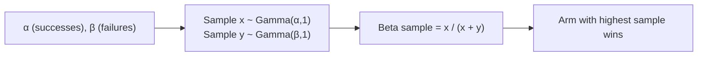
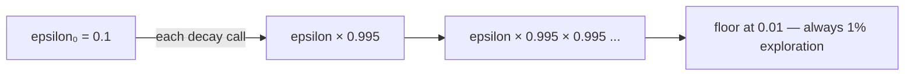

# Bandit Engine

How the multi-armed bandit algorithms select variants and learn from rewards.

## Algorithm Selection Flow



## Reward Update Flow



## Beta Distribution Sampling (Johnk Method)



**Initial state:** α=1, β=1 (uninformed prior — equal probability for all arms)

**Interpretation:**
- High α, low β → arm is rewarded often → high sample → likely selected (exploit)
- Equal α=β → uncertain → high variance in samples → natural exploration

## PersonaArmStats Key

Each arm is uniquely keyed by `(personaId, agentId, variantId)`:

```
PersonaArmStats
├── personaId  → which user segment
├── agentId    → which optimization campaign
├── variantId  → which message variant (arm)
├── alpha      → cumulative positive reward weight
├── beta       → cumulative failure count
├── tries      → total selections
└── wins       → total conversions
```

This means: **each persona gets its own bandit model per agent**. A variant that works for
Persona A may not be selected for Persona B if its arm stats differ.

## Epsilon-Greedy Decay


