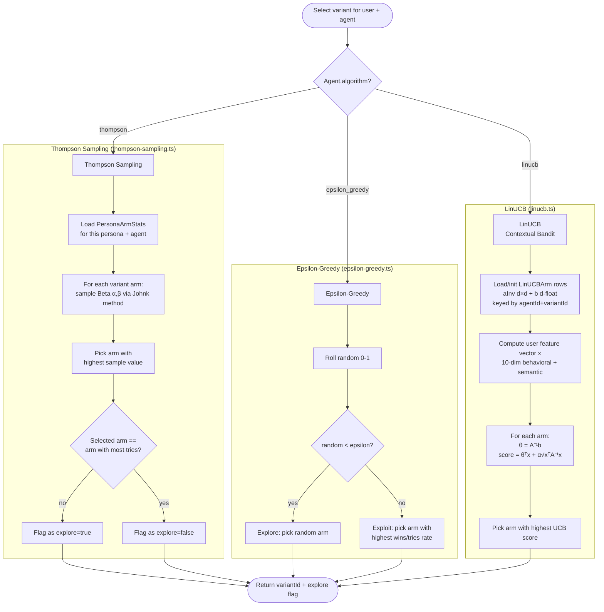
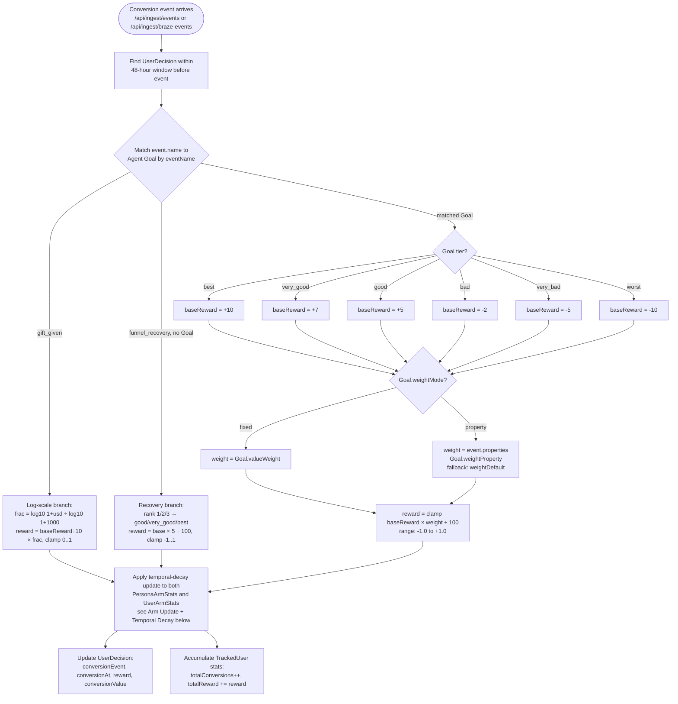
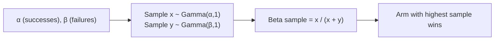
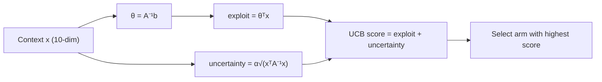

# Bandit Engine

How the multi-armed bandit algorithms select variants and learn from rewards.

## Algorithm Selection Flow



## Reward Update Flow



`calculateReward` lives in `src/lib/engine/reward-calculator.ts` (pure). Two special-cased
events bypass the tier×weight path: `gift_given` (amount-weighted on a log scale so larger
gifts read higher without saturating, capped at `$1000` → reward 1.0) and `funnel_recovery`
(a synthetic event emitted when a user climbs back out of a lapsed funnel stage — see
`docs/data-flows.md`). The recovery branch only fires when the agent has **no** explicit
`funnel_recovery` Goal; otherwise the normal tier×weight path applies.

## Beta Distribution Sampling (Johnk Method)



**Initial state:** α=1, β=30 — a pessimistic `Beta(1,30)` prior tuned to low baseline push
conversion rates, which damps noisy over-exploration during warm-up. Cold-start arms with no
`PersonaArmStats` row yet are seeded with these same values at selection time.

**Interpretation:**
- High α, low β → arm is rewarded often → high sample → likely selected (exploit)
- Low α, high β (warm-up state) → low samples, but uncertainty still lets arms win occasionally → natural exploration

## PersonaArmStats Key

Each arm is uniquely keyed by `(personaId, agentId, variantId)`:

```
PersonaArmStats
├── personaId  → which user segment
├── agentId    → which optimization campaign
├── variantId  → which message variant (arm)
├── alpha      → cumulative positive reward mass
├── beta       → cumulative non-positive evidence
├── tries      → total selections
└── wins       → total positive-reward outcomes
```

This means: **each persona gets its own bandit model per agent**. A variant that works for
Persona A may not be selected for Persona B if its arm stats differ.

## Per-User Blending (blendArm)

At selection time the persona-level prior is blended with that user's own posterior
(`UserArmStats`, keyed by `(userId, agentId, variantId)`) via `blendArm` in
`src/lib/engine/select-variant.ts`:

```
alpha = personaArm.alpha + userStats.wins
beta  = personaArm.beta  + (userStats.tries − userStats.wins)
```

A user with personal history pulls the estimate toward their own behavior; a user with no
history (zero tries) gets the persona prior unchanged. LinUCB does not blend — its context
vector already carries the per-user profile.

## Arm Update + Temporal Decay

Arm updates happen in the IO layer (`src/lib/arm-stats.ts`), not in the pure engine, because
they run as atomic `$queryRaw` upserts. Every update applies a ~0.99 multiplicative decay to
the accumulated mass above the prior so stale evidence fades and the bandit keeps adapting:

```
alpha_new = GREATEST(1,  1 + (alpha − 1) × 0.99 + Δalpha)
beta_new  = GREATEST(1,  1 + (beta  − 1) × 0.99 + Δbeta)
```

where a positive reward contributes `Δalpha = reward`, and a non-positive reward contributes
`Δbeta = 1`. The same decay is applied to both `PersonaArmStats` and `UserArmStats`.

## Epsilon-Greedy

`EpsilonGreedy` (`src/lib/engine/epsilon-greedy.ts`) takes a fixed `epsilon` (default `0.1`)
and does **not** decay it: each call rolls `random() < epsilon` to explore (uniform random
arm) vs. exploit (highest `wins/tries` rate). Decay, if desired, would be applied by the
caller — the engine itself keeps epsilon constant.

## LinUCB — Contextual Bandit

Uses the user's 10-dim feature vector as context to personalise variant selection.



**Arm state (LinUCBArm table):**
- `aInv` — flattened d×d inverse design matrix (100 floats for d=10); initialised to identity I
- `b` — d-float accumulated reward vector; initialised to zero
- `tries` — total selections

**Update rule (Sherman-Morrison rank-1 inverse update):**
```
A⁻¹_new = A⁻¹ − (A⁻¹x)(A⁻¹x)ᵀ / (1 + xᵀA⁻¹x)
b_new   = b + reward · x
```

Unlike Thompson Sampling and Epsilon-Greedy, LinUCB arms are **not** segmented by persona — the context vector x already carries the user's behavioral profile, so a single model per (agentId, variantId) pair is sufficient.

**Reference:** Chu et al. (2011) "Contextual Bandits with Linear Payoff Functions"
