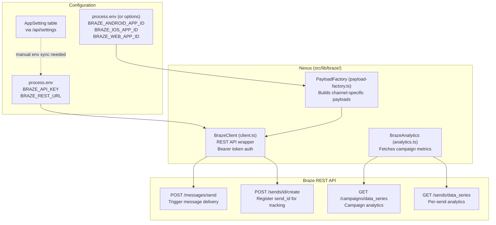
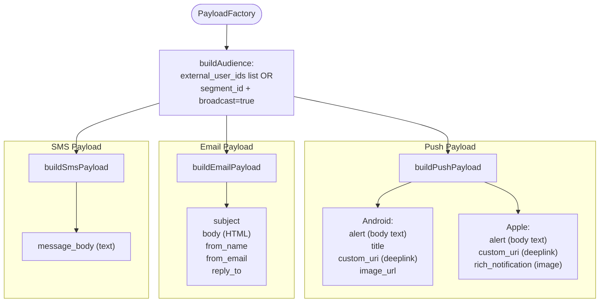
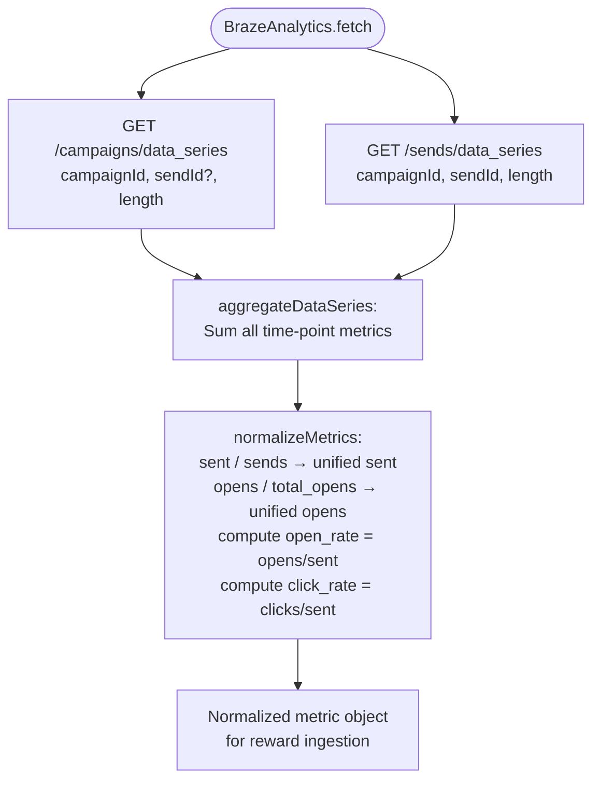

# Braze Integration

How Nexus communicates with the Braze CDP for message delivery and analytics.

## Architecture



## Payload Factory — Channel Payloads



## Analytics Fetch & Normalization



## createBrazeClient — Graceful Degradation

```typescript
// src/lib/braze/client.ts
export function createBrazeClient(): BrazeClient | null {
  const apiKey = process.env.BRAZE_API_KEY
  const restUrl = process.env.BRAZE_REST_URL
  if (!apiKey || !restUrl) return null   // app runs without Braze
  return new BrazeClient(apiKey, restUrl)
}
```

If `BRAZE_API_KEY` or `BRAZE_REST_URL` are missing, all Braze calls are skipped
and the app continues to function for local dev / analytics-only use.

## Braze REST URL Normalization

The client strips any protocol prefix and re-adds `https://`:
```
"rest.iad-01.braze.com"      → "https://rest.iad-01.braze.com"
"https://rest.iad-01.braze.com" → "https://rest.iad-01.braze.com"
```

## Send ID Tracking

Nexus creates a unique `send_id` per campaign send via `POST /sends/id/create`.
The `brazeSendId` is then stored on `UserDecision` and `Message`/`MessageVariant`
records for per-send analytics attribution.

## Environment Variables

| Variable | Source | Purpose |
|----------|--------|---------|
| `BRAZE_API_KEY` | env / AppSetting | REST API authentication |
| `BRAZE_REST_URL` | env / AppSetting | API base URL (e.g. `rest.iad-01.braze.com`) |
| `BRAZE_ANDROID_APP_ID` | env / AppSetting | Android push app identifier |
| `BRAZE_IOS_APP_ID` | env / AppSetting | iOS push app identifier |
| `BRAZE_WEB_APP_ID` | env / AppSetting | Web push app identifier |
| `BRAZE_APP_GROUP_ID` | env / AppSetting | Braze workspace identifier |

> **Note:** `BrazeClient` reads from `process.env` at instantiation time. Settings saved via
> the UI persist to the `AppSetting` DB table but require a server restart or explicit env
> var injection to take effect in the running process.
