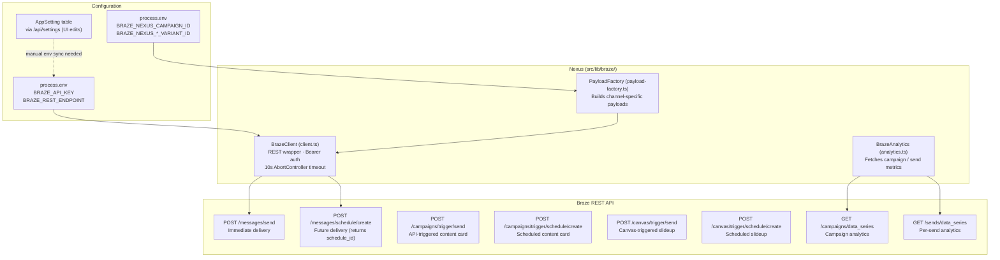
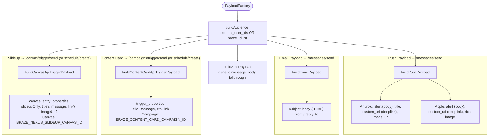
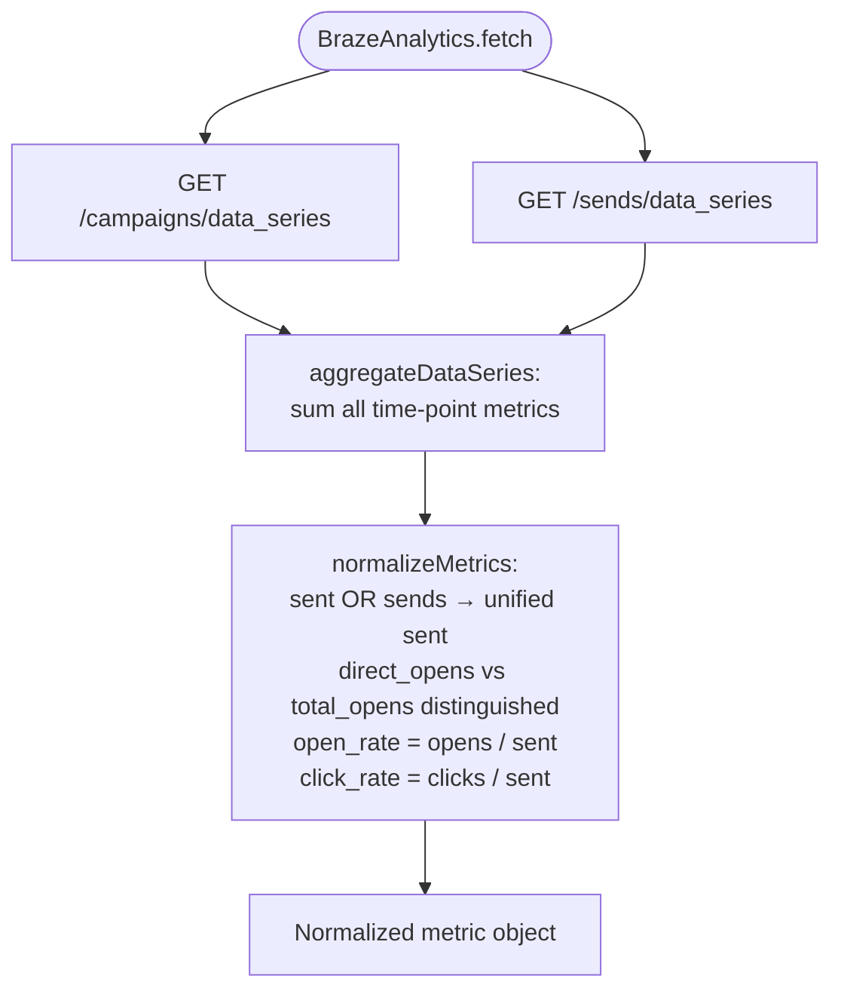

# Braze Integration

How Nexus communicates with the Braze CDP for message delivery and analytics.

## Architecture



## Send model — all sends attributed to one Nexus campaign

Every Nexus send targets a **single Braze campaign** (`BRAZE_NEXUS_CAMPAIGN_ID`)
with per-channel message variations (`BRAZE_NEXUS_IOS_VARIANT_ID`,
`BRAZE_NEXUS_ANDROID_VARIANT_ID`, `BRAZE_NEXUS_EMAIL_VARIANT_ID`,
`BRAZE_NEXUS_CONTENTCARD_VARIANT_ID`). The bandit's chosen copy is injected into
the payload at send time; Braze analytics roll up under this one campaign.

The cron groups decisions by `(variantId × scheduledAt × inLocalTime)` and routes
each group to the right endpoint (`src/lib/cron/send-grouping.ts`):

- **Future send time** → `POST /messages/schedule/create` with
  `schedule: { time }`. The returned `schedule_id` is stored on
  `UserDecision.brazeScheduleId`.
- **Immediate** → `POST /messages/send`.

### `brazeSendId` is a local marker, not a Braze send_id

Nexus does **not** call `/sends/id/create`. It generates a local
`randomUUID()` and stores it on the batch's `UserDecision` rows as an
"accepted by Braze" marker (used by the analytics cron's daily-cap counter).
The real Braze `send_id` is auto-assigned by Braze and arrives back via Braze
Currents at `POST /api/ingest/braze-events` — the **primary reward path**.

## Payload Factory — Channel Payloads

`PayloadFactory` exposes dedicated builders per channel. All builders attach
`in_local_time: true` when the group was scheduled in local-time fallback mode.



> **Message channels** are `push | email | in-app | content-card` (the
> `Message.channel` enum). The send grouping routes:
> - `push` → `buildPushPayload` → `POST /messages/send` (or `/messages/schedule/create`)
> - `email` → `buildEmailPayload` → `POST /messages/send` (or `/messages/schedule/create`)
> - `content-card` → `buildContentCardApiTriggerPayload` → `POST /campaigns/trigger/send`
>   (or `/campaigns/trigger/schedule/create`). Campaign: `BRAZE_CONTENT_CARD_CAMPAIGN_ID`.
>   The campaign template resolves `{{api_trigger_properties.${title}}}`, `${message}`, `${cta}`, `${link}`.
> - `in-app` → `buildCanvasApiTriggerPayload` → `POST /canvas/trigger/send`
>   (or `/canvas/trigger/schedule/create`). Canvas: `BRAZE_NEXUS_SLIDEUP_CANVAS_ID`.
>   Canvas entry properties: `slideupOnly` (derived from `title === null`), `title`, `message`, `link`, `imageUrl`.
>   The canvas Decision Split routes `slideupOnly=true` to slideup-only step, `false` to push-then-slideup.
> - everything else → `buildSmsPayload` (generic body fallthrough)

## Analytics Fetch & Normalization

`BrazeAnalytics` (used by the `ingest-braze-analytics` decay sweep, not the
primary reward path) reconciles Braze's inconsistent field names.



> Braze returns send counts under either `sent` or `sends` within the same
> response, and reports `direct_opens` separately from `total_opens` — the
> normalizer checks both to avoid silently dropping metrics.

## createBrazeClient — Graceful Degradation

```typescript
// src/lib/braze/client.ts
export function createBrazeClient(): BrazeClient | null {
  const apiKey = process.env.BRAZE_API_KEY;
  const restUrl = process.env.BRAZE_REST_ENDPOINT ?? process.env.BRAZE_REST_URL;
  if (!apiKey || !restUrl) return null;   // app runs without Braze
  return new BrazeClient(apiKey, restUrl);
}
```

If `BRAZE_API_KEY` or the REST endpoint is missing, `createBrazeClient` returns
`null` and all Braze calls are skipped — the app keeps working for local dev and
analytics-only use. `BRAZE_REST_ENDPOINT` is the canonical key; `BRAZE_REST_URL`
remains a legacy fallback.

## REST endpoint normalization & timeouts

`BrazeClient` prefixes a bare host with `https://` and strips a trailing slash
(`rest.iad-01.braze.com` → `https://rest.iad-01.braze.com`). Both `post()` and
`get()` wrap each request in a **10-second `AbortController` timeout** with
`finally` cleanup, so a hung Braze call can't stall an ingest or cron path.

## Environment Variables

| Variable | Purpose |
|----------|---------|
| `BRAZE_API_KEY` | REST API authentication |
| `BRAZE_REST_ENDPOINT` | API base (e.g. `rest.iad-01.braze.com`); `BRAZE_REST_URL` is a legacy fallback |
| `BRAZE_NEXUS_CAMPAIGN_ID` | The single campaign all Nexus sends are attributed to |
| `BRAZE_NEXUS_IOS_VARIANT_ID` | iOS push message variation within the Nexus campaign |
| `BRAZE_NEXUS_ANDROID_VARIANT_ID` | Android push message variation |
| `BRAZE_NEXUS_EMAIL_VARIANT_ID` | Email message variation |
| `BRAZE_NEXUS_CONTENTCARD_VARIANT_ID` | Content-card message variation |
| `BRAZE_CONTENT_CARD_CAMPAIGN_ID` | API-triggered content card campaign (required for `in-app` channel sends) |
| `BRAZE_NEXUS_SLIDEUP_CANVAS_ID` | Canvas ID for slideup sends (required for `in-app` channel sends) |
| `BRAZE_ANDROID_APP_ID` / `BRAZE_IOS_APP_ID` / `BRAZE_WEB_APP_ID` | Optional platform app identifiers used in push payload construction |

> **Config source:** `BrazeClient` reads from `process.env` at instantiation.
> Settings saved via the UI persist to the `AppSetting` table but require a server
> restart or explicit env sync to take effect in the running process.
