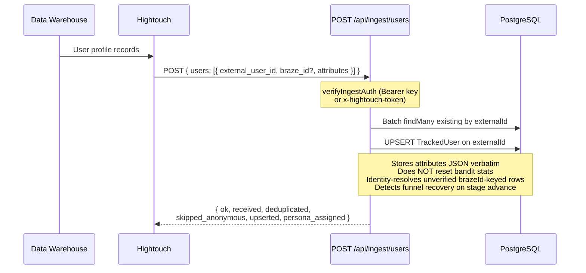
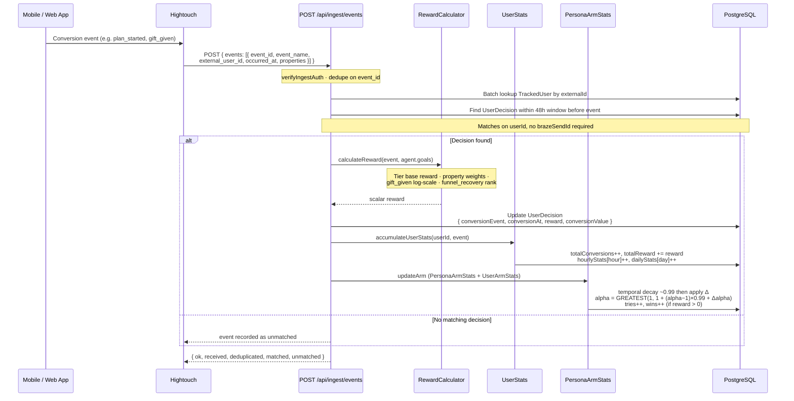
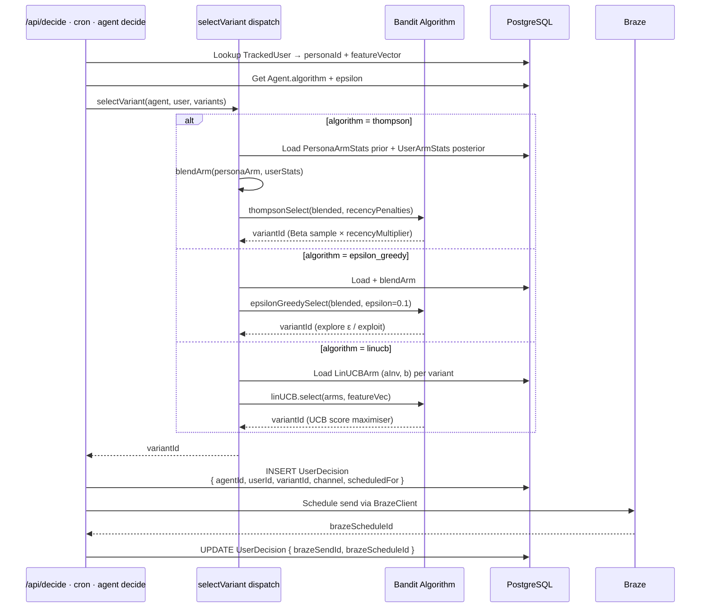
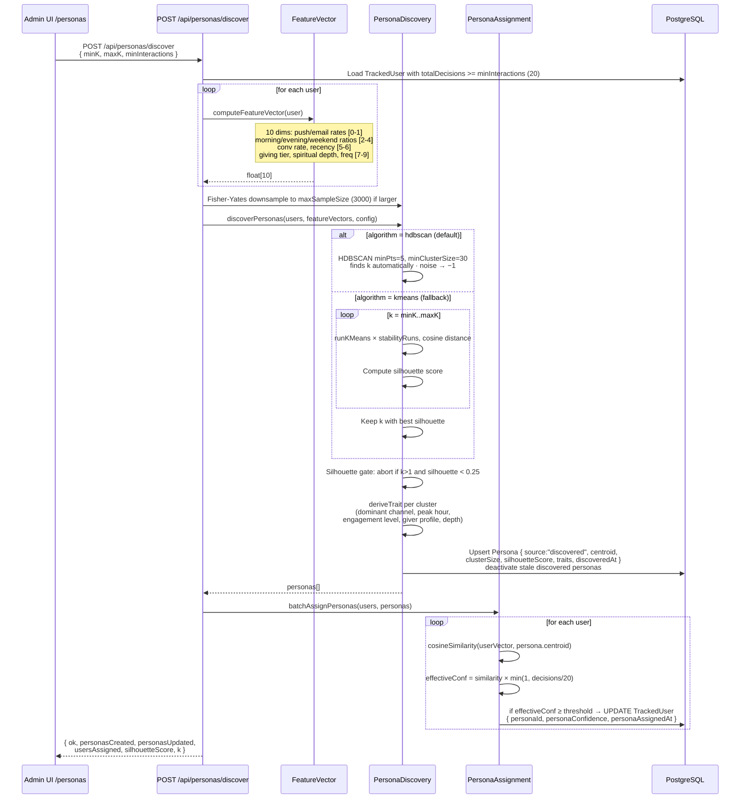
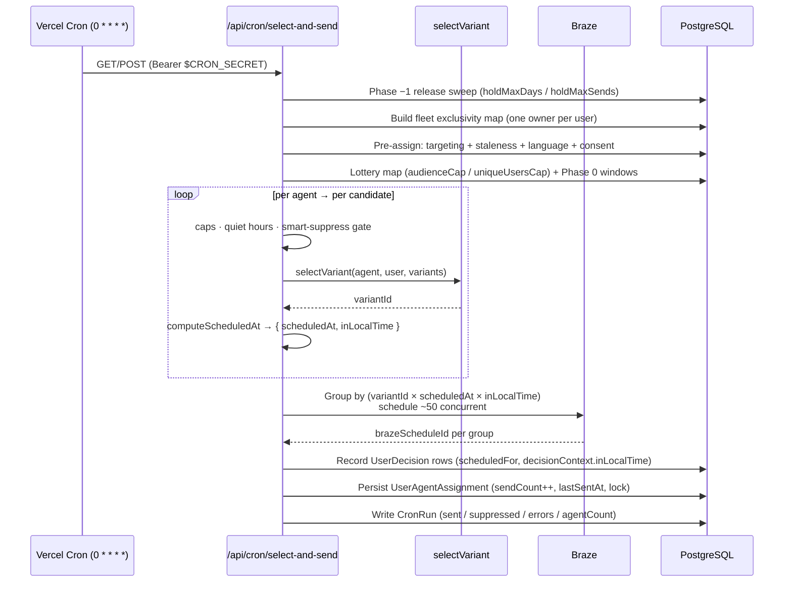

# Data Flows

End-to-end flows for the main system operations.

## Flow 1: User Profile Ingestion

Hightouch syncs user profiles from the data warehouse into Nexus using the nested
`{ users: [...] }` format, which stores the full `attributes` object verbatim.



## Flow 2: Conversion Event Ingestion → Reward Loop

The critical learning loop: events arrive and update the bandit's arm stats. The
**primary** reward path is `/api/ingest/braze-events` (Braze Currents click →
reward); `/api/ingest/events` is the generic Hightouch event path shown here.
Both are idempotent on `event_id` via the `ProcessedEventId` table.



## Flow 3: Variant Selection (Bandit Decision)

How a variant is chosen for a user. Selection is exposed as a real route —
`POST /api/decide` (ingest-auth, `src/lib/decide.ts`) and
`POST /api/agents/:id/decide` (cron) — and is also invoked inline by the
`select-and-send` cron. All paths share the `selectVariant` dispatch in
`src/lib/engine/select-variant.ts`.



## Flow 4: Persona Discovery & Assignment

Periodic clustering of users into personas.



## Flow 5: Settings & Braze Configuration

```mermaid
sequenceDiagram
    participant UI as Settings Page /settings
    participant API as /api/settings
    participant DB as AppSetting table

    UI->>API: POST { BRAZE_API_KEY, BRAZE_REST_ENDPOINT, ... }
    Note over UI,API: requireAdmin (WorkOS session)
    API->>DB: UPSERT AppSetting per key
    Note over API,DB: Keys: BRAZE_API_KEY, BRAZE_REST_ENDPOINT,<br/>BRAZE_NEXUS_CAMPAIGN_ID,<br/>BRAZE_NEXUS_IOS_VARIANT_ID, ...

    UI->>API: GET /api/settings
    API->>DB: SELECT all AppSettings
    API-->>UI: { data: { BRAZE_API_KEY, BRAZE_REST_ENDPOINT, ... } }

    Note over API,DB: createBrazeClient() reads BRAZE_API_KEY +<br/>BRAZE_REST_ENDPOINT from process.env; returns null<br/>when unset, so Braze calls degrade gracefully.<br/>AppSetting persists UI edits but needs an env sync.
```

## Flow 6: Hourly Send Pipeline

The `select-and-send` cron (`0 * * * *`) is the system's heartbeat: it assigns
users to agents, picks variants, schedules sends, and persists ownership. The
full phase-by-phase breakdown lives in `docs/send-timing-architecture.md`; the
sequence below is the condensed view.


