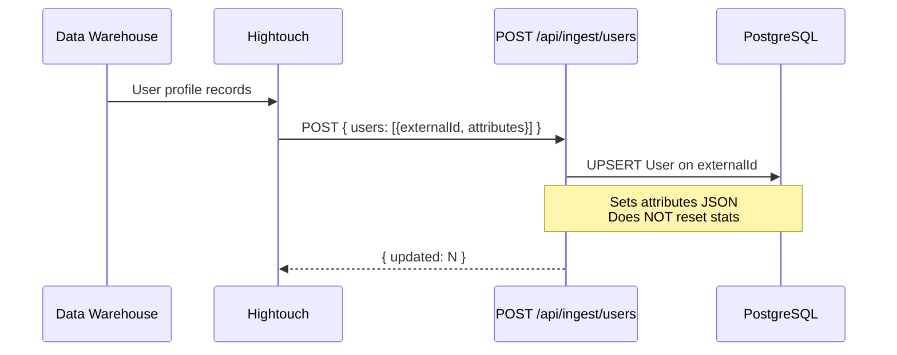
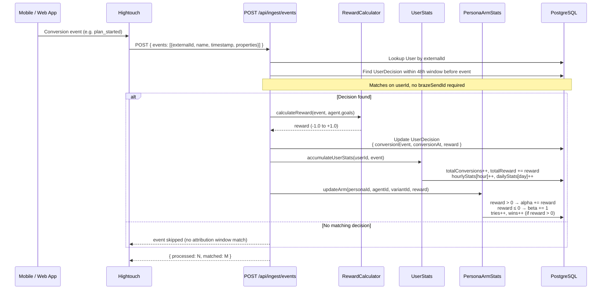
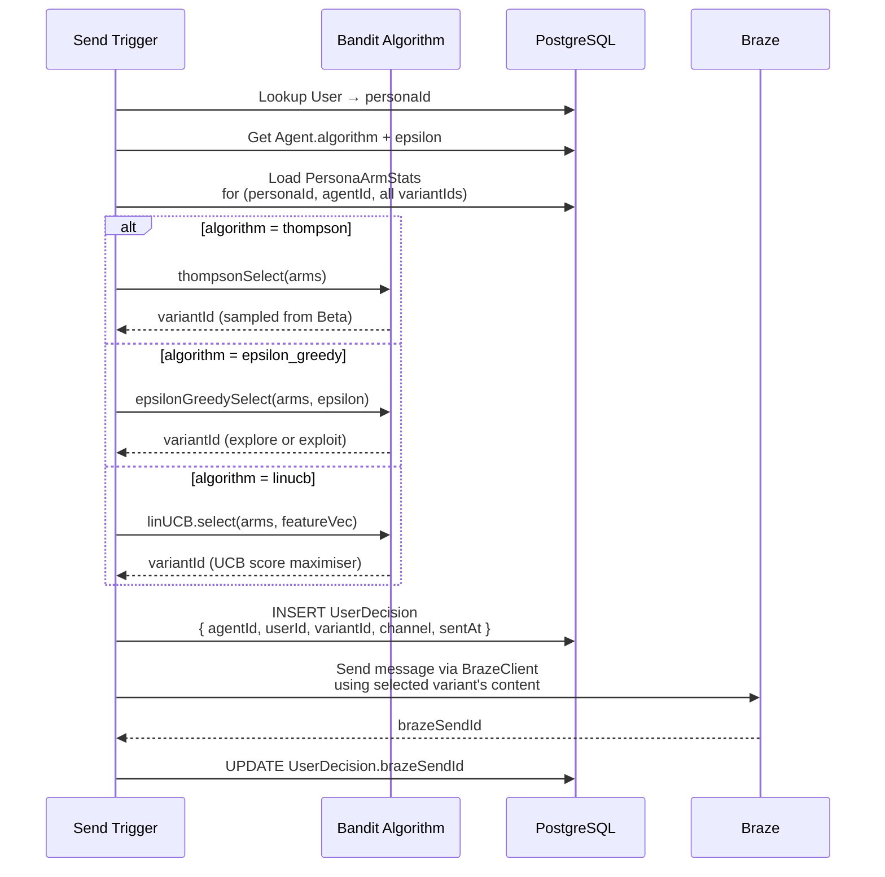
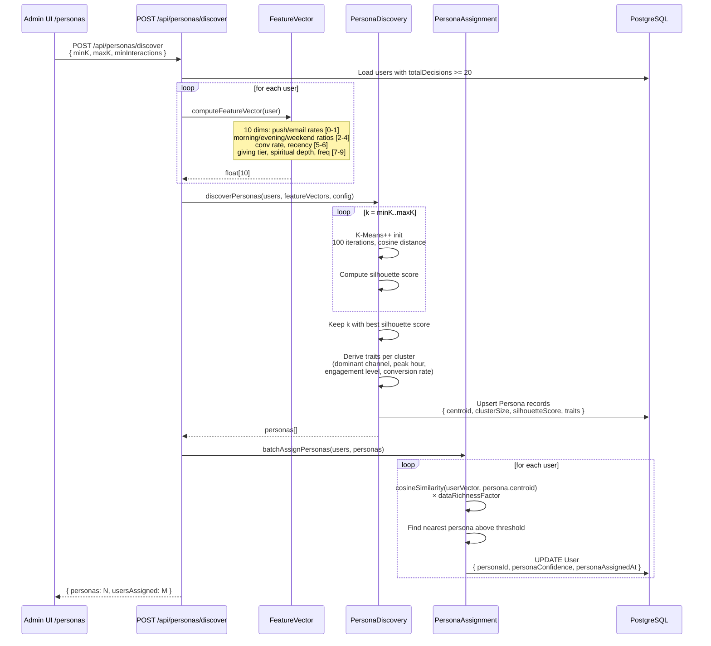

# Data Flows

End-to-end flows for the four main system operations.

## Flow 1: User Profile Ingestion

Hightouch syncs user profiles from the data warehouse into Nexus.



## Flow 2: Conversion Event Ingestion → Reward Loop

The critical learning loop: events arrive and update the bandit's arm stats.



## Flow 3: Variant Selection (Bandit Decision)

How a variant is chosen for a user at send time.
> Note: The selection endpoint is not yet a standalone API route — the logic lives in
> `src/lib/engine/` and is invoked inline or via Braze-triggered flows.



## Flow 4: Persona Discovery & Assignment

Periodic clustering of users into personas.



## Flow 5: Settings & Braze Configuration

```mermaid
sequenceDiagram
    participant UI as Settings Page /settings
    participant API as /api/settings
    participant DB as AppSetting table
    participant ENV as process.env

    UI->>API: POST { BRAZE_API_KEY, BRAZE_REST_URL, ... }
    API->>DB: UPSERT AppSetting per key
    Note over API,DB: Keys: BRAZE_API_KEY, BRAZE_REST_URL,<br/>BRAZE_ANDROID_APP_ID, BRAZE_IOS_APP_ID,<br/>BRAZE_WEB_APP_ID, BRAZE_APP_GROUP_ID

    UI->>API: GET /api/settings
    API->>DB: SELECT all AppSettings
    API-->>UI: { BRAZE_API_KEY: "...", ... }

    Note over ENV: BrazeClient reads from process.env at runtime.<br/>Settings UI saves to DB; a restart or env sync<br/>is needed for changes to take effect in BrazeClient.
```
