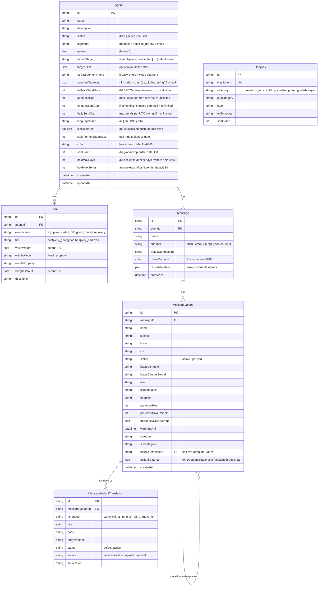
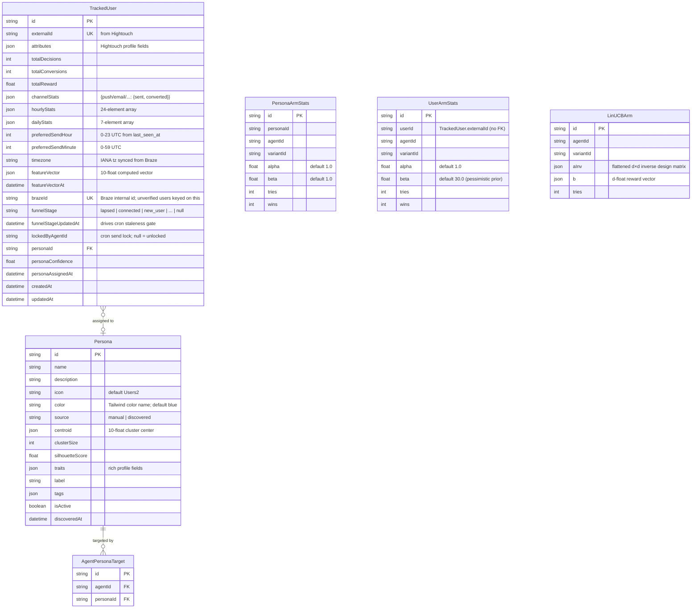
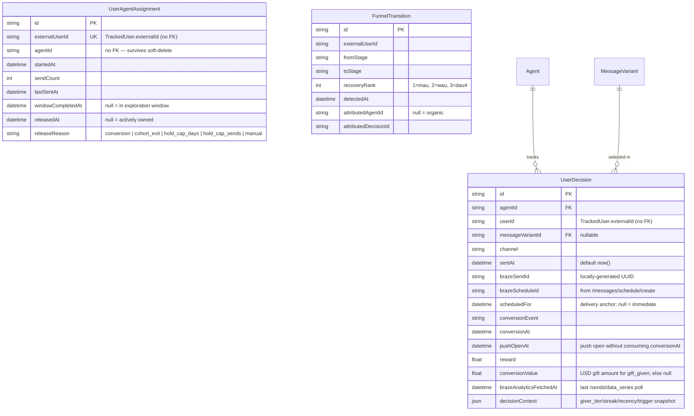
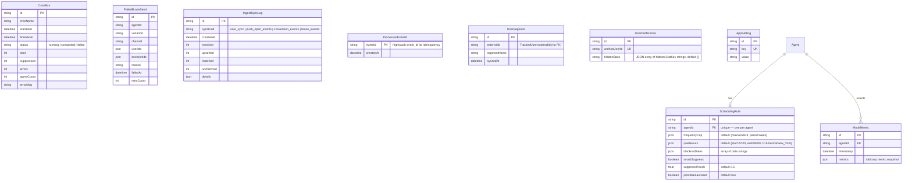
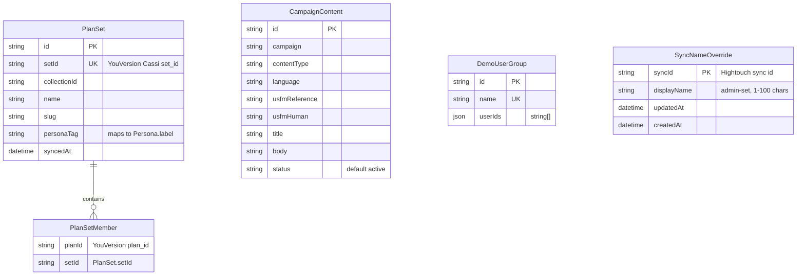

# Data Model

Entity-relationship diagram of the Prisma models. The schema lives in `prisma/schema.prisma`.

> **Naming note:** the YouVersion app-user model is `TrackedUser` in Prisma but is mapped to
> the existing **`User`** database table via `@@map("User")`. Several models reference a user
> by `externalId`/`userId` **without a foreign key** on purpose (e.g. `UserDecision.userId`,
> `UserArmStats.userId`, `UserAgentAssignment.externalUserId`, `UserSegment.externalId`,
> `TrackedUser.lockedByAgentId`) so the rows survive agent soft-deletes and user re-keying.

## Core campaign + messaging



## Users, personas, and bandit arms



Bandit arms are **not** linked by Prisma relations — they are keyed tuples:
`PersonaArmStats(personaId, agentId, variantId)`, `UserArmStats(userId, agentId, variantId)`,
`LinUCBArm(agentId, variantId)`. See `docs/bandit-engine.md` for how they're read, blended,
and updated.

## Decisions, ownership, and funnel recovery



## Scheduling, metrics, ops, and settings



## Auxiliary classification + content



`PlanSet`/`PlanSetMember` back the rule-based persona classifier (mapping YouVersion plan_ids
to persona tags). `CampaignContent` stores per-language scripture content for campaigns.
`DemoUserGroup` holds named test-user ID sets for the Live Send Demo. `SyncNameOverride` is a
pure `syncId → displayName` lookup that lets admins rename a Hightouch sync for display on the
Data Ingest page; it is **display-only** and never participates in triggering (which keys purely
off the raw sync id).

## JSON Field Schemas

### `TrackedUser.channelStats`
```json
{
  "push":  { "sent": 12, "converted": 3 },
  "email": { "sent": 5,  "converted": 1 }
}
```

### `TrackedUser.featureVector` — 10 dimensions
```
[0] push conversion rate          [5] overall conversion rate
[1] email conversion rate         [6] recency score (1 − days_since_open/90)
[2] morning ratio (hrs 5–11)      [7] giving tier (0=none, 0.5=giver, 1=sower)
[3] evening ratio (hrs 17–22)     [8] spiritual depth (streak+plan+prayer+scripture+badge)
[4] weekend ratio (Sat+Sun)       [9] engagement freq (log-scaled decisions/week)
```
`FEATURE_DIM = 10` (`src/lib/engine/feature-vector.ts`). `Persona.centroid` and `LinUCBArm`
matrices are sized to this dimension. (The old "37-dim" layout in prior docs is obsolete.)

### `Agent.segmentTargeting`
```json
{ "includes": ["lapsed_mau", "gave_last_year"], "excludes": ["staff"] }
```
`null` falls back to `targetSegmentName`/`funnelStage`. Include semantics are OR within the
includes list; excludes remove members. See `docs/nexus-agent-targeting-spec.md`.

### `SchedulingRule.frequencyCap`
```json
{ "maxSends": 3, "period": "week" }
```

### `UserDecision.decisionContext`
```json
{ "giver_tier": "giver", "streak_status": "active", "streak_days": 14,
  "recency_days": 2, "trigger_event": "plan_completed" }
```

### `Persona.traits`
```json
{
  "engagementLevel": "daily",
  "dominantChannel": "push",
  "peakHour": 9,
  "giverProfile": "giver",
  "conversionRate": 0.18
}
```
