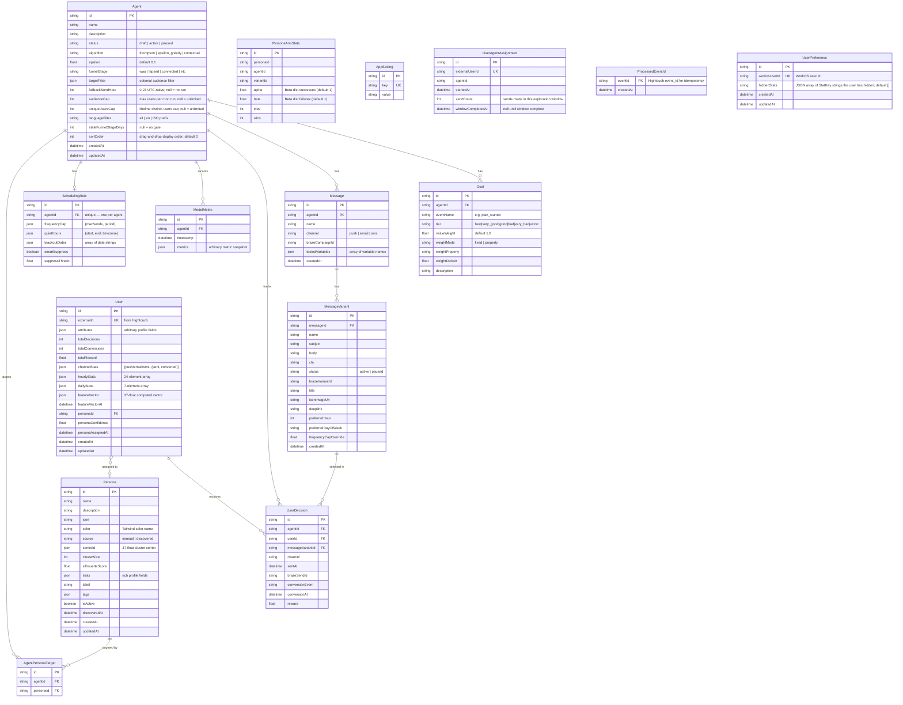

# Data Model

Entity-relationship diagram of all Prisma models.



## JSON Field Schemas

### `User.channelStats`
```json
{
  "push":  { "sent": 12, "converted": 3 },
  "email": { "sent": 5,  "converted": 1 },
  "sms":   { "sent": 0,  "converted": 0 }
}
```

### `User.featureVector` — 37 dimensions
```
[0-2]   channel conversion rates (push, email, sms)
[3-26]  hour-of-day normalized histogram (24 dims)
[27-33] day-of-week normalized histogram (7 dims)
[34]    overall conversion rate
[35]    engagement frequency (log-scaled decisions/week)
[36]    average reward magnitude
```

### `SchedulingRule.frequencyCap`
```json
{ "maxSends": 2, "period": "week" }
```

### `Persona.traits` (rich discovered/manual fields)
```json
{
  "engagementLevel": "daily",
  "contentModes": ["text", "plans"],
  "ageRange": "25-34",
  "gender": "male",
  "conversionRate": 0.18,
  "churnRisk": "low",
  "ltv": 4.2
}
```
