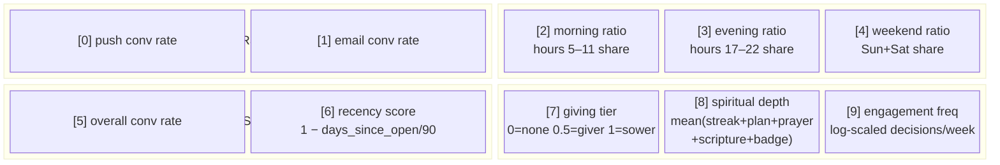
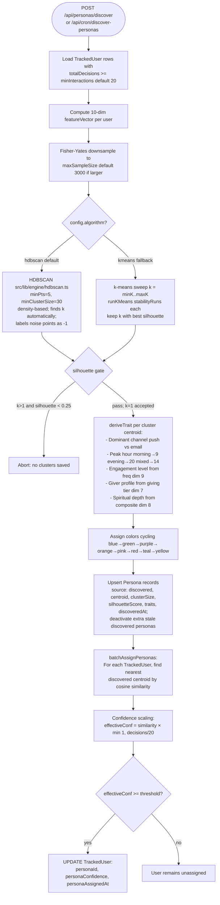

# Persona Discovery

How users are clustered into personas using unsupervised ML.

## Feature Vector — 10 Dimensions



## Discovery Algorithm

Discovery is orchestrated by `discoverPersonas()` in `src/lib/services/persona-service.ts`
and triggered by `POST /api/personas/discover` (admin-only) or the
`/api/cron/discover-personas` cron. It supports two clustering algorithms; **HDBSCAN is the
default**, with k-means available as an explicit fallback (`config.algorithm: "kmeans"`).



**HDBSCAN vs. k-means.** HDBSCAN is density-based: it finds the cluster count automatically,
tolerates clusters of varying size, and labels low-density points as noise (`-1`, excluded
from centroids and the silhouette calculation). k-means requires a fixed `k`, so the fallback
path sweeps `k = minK..maxK` (default 3..15) running `runKMeans` `stabilityRuns` times per `k`
and keeps the `k` with the best silhouette score. Both gate on a minimum silhouette of `0.25`
(a single-cluster HDBSCAN result `k=1` is accepted without the gate, since `minClusterSize`
already guarantees density). `TrackedUser` is the Prisma model mapped to the `User` table.

## Cosine Similarity

Used for both cluster assignment and persona assignment:

```
similarity(u, v) = (u · v) / (|u| × |v|)

Range: 0.0 (orthogonal) to 1.0 (identical direction)
```

Users with similar channel preferences, timing patterns, and engagement level
will have feature vectors pointing in the same direction → high cosine similarity.

## Persona Color Palette (cycling)

| Index | Color | Tailwind classes |
|-------|-------|-----------------|
| 0 | blue | bg-blue-100 text-blue-700 border-blue-200 |
| 1 | green | bg-green-100 text-green-700 border-green-200 |
| 2 | purple | bg-purple-100 text-purple-700 border-purple-200 |
| 3 | orange | bg-orange-100 text-orange-700 border-orange-200 |
| 4 | pink | bg-pink-100 text-pink-700 border-pink-200 |
| 5 | red | bg-red-100 text-red-700 border-red-200 |
| 6 | teal | bg-teal-100 text-teal-700 border-teal-200 |
| 7 | yellow | bg-yellow-100 text-yellow-700 border-yellow-200 |

## Engagement Level Buckets

Derived from `featureVector[9]` (log-scaled engagement frequency, range 0–1):

| Level | Condition |
|-------|-----------|
| `daily` | freq > 0.7 |
| `regular` | 0.5 < freq ≤ 0.7 |
| `moderate` | 0.3 < freq ≤ 0.5 |
| `weekly` | 0.15 < freq ≤ 0.3 |
| `sporadic` | freq ≤ 0.15 |
