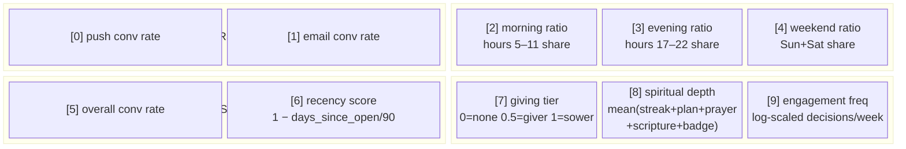

# Persona Discovery

How users are clustered into personas using unsupervised ML.

## Feature Vector — 10 Dimensions



## K-Means++ Discovery Algorithm

```mermaid
flowchart TD
    START([POST /api/personas/discover]) --> LOAD[Load users with<br/>totalDecisions >= minInteractions]
    LOAD --> VECS[Compute featureVector<br/>for each eligible user]

    VECS --> KLOOP{Try k = minK to maxK}

    subgraph KMEANS["K-Means++ per k"]
        KLOOP --> INIT[K-Means++ Initialization:<br/>Pick 1st centroid randomly<br/>Pick subsequent centroids<br/>proportional to cosine distance²]
        INIT --> ITER[Iterate up to 100 times:<br/>1. Assign each user to nearest centroid<br/>2. Recompute centroid as mean of cluster]
        ITER --> CONV{Converged?}
        CONV -->|yes| SILO[Compute Silhouette Score:<br/>for each user: (b-a) / max(a,b)<br/>a = avg dist to same cluster<br/>b = avg dist to nearest other cluster]
        CONV -->|no, more iters| ITER
    end

    SILO --> BEST{Best silhouette<br/>so far?}
    BEST -->|yes| SAVE[Save this k + centroids]
    BEST -->|no| KLOOP
    KLOOP -->|k > maxK| TRAITS

    TRAITS[Derive traits for each cluster:<br/>- Dominant channel (push vs email)<br/>- Peak hour: morning→9, evening→20, mixed→14<br/>- Engagement level from freq (dim 9)<br/>- Giver profile from giving tier (dim 7)<br/>- Spiritual depth from composite (dim 8)]

    TRAITS --> COLORS[Assign colors cycling through:<br/>blue → green → purple → orange →<br/>pink → red → teal → yellow]

    COLORS --> UPSERT[Upsert Persona records<br/>{ centroid, clusterSize,<br/>silhouetteScore, traits, source: discovered }]

    UPSERT --> ASSIGN[batchAssignPersonas:<br/>For each user, find nearest centroid<br/>by cosine similarity]

    ASSIGN --> CONF[Confidence scaling:<br/>effectiveConf = similarity × min(1, decisions/20)]
    CONF --> THRESH{effectiveConf >= threshold?}
    THRESH -->|yes| PERSIST[UPDATE User:<br/>personaId, personaConfidence,<br/>personaAssignedAt]
    THRESH -->|no| SKIP[User remains unassigned]
```

## Cosine Similarity

Used for both cluster assignment and persona assignment:

```
similarity(u, v) = (u · v) / (|u| × |v|)

Range: 0.0 (orthogonal) to 1.0 (identical direction)
```

Users with similar channel preferences, timing patterns, and engagement level
will have feature vectors pointing in the same direction → high cosine similarity.

## Persona Color Palette (cycling)

| Index | Color | Tailwind classes |
|-------|-------|-----------------|
| 0 | blue | bg-blue-100 text-blue-700 border-blue-200 |
| 1 | green | bg-green-100 text-green-700 border-green-200 |
| 2 | purple | bg-purple-100 text-purple-700 border-purple-200 |
| 3 | orange | bg-orange-100 text-orange-700 border-orange-200 |
| 4 | pink | bg-pink-100 text-pink-700 border-pink-200 |
| 5 | red | bg-red-100 text-red-700 border-red-200 |
| 6 | teal | bg-teal-100 text-teal-700 border-teal-200 |
| 7 | yellow | bg-yellow-100 text-yellow-700 border-yellow-200 |

## Engagement Level Buckets

Derived from `featureVector[9]` (log-scaled engagement frequency, range 0–1):

| Level | Condition |
|-------|-----------|
| `daily` | freq > 0.7 |
| `regular` | 0.5 < freq ≤ 0.7 |
| `moderate` | 0.3 < freq ≤ 0.5 |
| `weekly` | 0.15 < freq ≤ 0.3 |
| `sporadic` | freq ≤ 0.15 |
