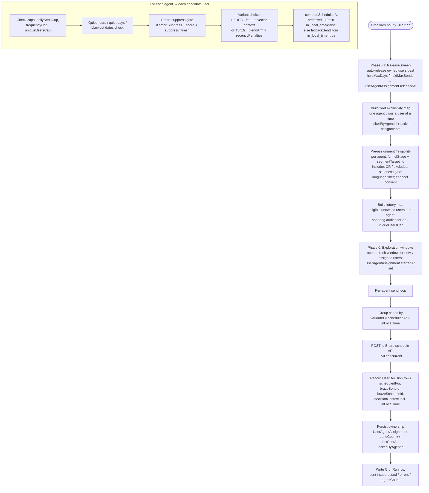

# Send Timing Architecture

## 1. Overview

Nexus sends notifications through Braze via an **hourly** Vercel cron
(`/api/cron/select-and-send`, schedule `0 * * * *`). Each run walks every active
agent, selects eligible users, picks a message variant per user (LinUCB, Thompson
Sampling, or ε-Greedy), schedules the send through Braze, and records a
`UserDecision`. Per-user send time is derived from the user's historical session
patterns, with a per-agent fallback hour delivered `in_local_time` for users with
no session signal.

The hourly cadence is what makes global timezone coverage work: a user's
`preferredSendHour` is a UTC hour, so the run that fires during that hour is the
one that schedules their send. There is no need for a 24/7 worker — the cron
itself is the clock.

## 2. The send pipeline (per cron run)

`POST/GET /api/cron/select-and-send` executes these phases in order. The route is
authenticated with `Authorization: Bearer $CRON_SECRET`.



### Phase −1 — Release sweep

Before any sends, the run releases users whose ownership has expired:
`UserAgentAssignment` rows past the agent's `holdMaxDays` (default 90) or
`holdMaxSends` (default 24) get `releasedAt` set with a `releaseReason` of
`hold_cap_days` / `hold_cap_sends`. Conversions and cohort exits release users
elsewhere. Releasing first means freed users are eligible for re-assignment in the
same run.

### Fleet exclusivity

A user is owned by at most one agent at a time. The run builds a map of currently
owned users (`TrackedUser.lockedByAgentId` plus active `UserAgentAssignment` rows
with `releasedAt = null`) so the pre-assignment phase only hands out unowned
users.

### Pre-assignment / eligibility

Per agent, candidate users are filtered by:

- **Targeting** — `segmentTargeting` (`includes` OR-matched against `UserSegment`
  rows, `excludes` removed) when set; otherwise the legacy
  `targetSegmentName` / `funnelStage`. See `docs/nexus-agent-targeting-spec.md`.
- **Staleness gate** — if `staleFunnelStageDays` is set, users whose
  `funnelStageUpdatedAt` is older than the threshold are skipped.
- **Language filter** — `languageFilter` (`all` | `en` | ISO prefix).
- **Channel consent** — `newsletter_push_enabled` / `newsletter_email_enabled`
  from the user's Hightouch attributes.

### Lottery map & exploration windows

Eligible unowned users are collected per agent, honoring `audienceCap` (max users
per run) and `uniqueUsersCap` (lifetime distinct users). Phase 0 opens a fresh
exploration window for newly-assigned users by setting
`UserAgentAssignment.startedAt`.

### Per-agent send loop

For each candidate the loop enforces, in order: `dailySendCap` (sends per UTC
day), `frequencyCap` (`SchedulingRule`, default `{maxSends:3, period:week}`),
quiet hours / quiet days / blackout dates, then the optional smart-suppress gate
(`smartSuppress` + predicted score below `suppressThresh`).

## 3. Per-user send-time computation

### Preferred time (has session history)

- Hightouch syncs `LAST_SEEN_TIMESTAMP` → `TrackedUser.preferredSendHour` (UTC
  hour) and `preferredSendMinute` (UTC minute). It also syncs the user's IANA
  `timezone` from Braze.
- Because `LAST_SEEN_TIMESTAMP` is UTC, storing the UTC hour implicitly captures
  local time: a user in EST whose last session was 8:10am EST has
  `preferredSendHour = 13` (13:00 UTC).
- `computeScheduledAt` schedules the push **10 minutes before** the preferred UTC
  time using total-minutes arithmetic (so `minute < 10` rolls back the hour
  correctly), with `in_local_time = false` — it is an absolute UTC instant.
- **Only if that instant is still in the future** relative to the current run.
  Since the cron fires every hour, the run during the user's preferred hour is the
  one that catches it.

### Fallback time (no session history)

- Users without a usable preferred time get the agent's `fallbackSendHour`
  (default 8, range 0–23, set per-agent on the Scheduling tab).
- The fallback is scheduled with `in_local_time = true`, so Braze delivers at that
  wall-clock hour in **each recipient's own timezone**.
- If `fallbackSendHour` has already passed in UTC when the run fires,
  `computeScheduledAt` rolls forward to the **same hour the next day**.

### `inLocalTime` is persisted

The `inLocalTime` flag returned by `computeScheduledAt` is written into
`UserDecision.decisionContext`. Downstream pending-status checks read it to decide
whether to apply the 12-hour timezone-spread buffer: an `in_local_time` send has
no single UTC delivery instant (recipients span UTC−12…UTC+14), so a send is only
treated as truly past once `scheduledFor + 12h < now`.

## 4. Quiet hours, quiet days, blackouts

`SchedulingRule` carries `quietHours` (default `{start:"22:00", end:"08:00",
tz:"America/New_York"}`), `blackoutDates`, and the frequency cap. The scheduling
helpers (`src/lib/engine/scheduling.ts`) evaluate these against the **computed
`scheduledAt`**, not the cron execution time — so a send rolled forward to
tomorrow is checked against tomorrow's date, correctly catching blackout days.

## 5. Same-session suppression

Same-day session suppression remains approximate: Hightouch syncs `last_seen_at`
on a batch schedule, so it lags real organic sessions. The 10-minute pre-session
timing partly mitigates this — the push tends to land just before the user's
typical session window. Real-time event sync would enable a hard
`last_seen_at >= today_start` suppression check at schedule time.

## 6. Known limitations

| Limitation | Impact | Future fix |
|-----------|--------|-----------|
| Batch-lagged `last_seen_at` | No hard same-day session suppression | Real-time event sync → suppress if `last_seen_at >= today_start` |
| `preferredSendHour` from a single `last_seen_at` | Noisy first signal | Accumulate `hourlyStats` over time; use mode of last N sessions |
| No delivery confirmation | `scheduledFor` is when we called Braze, not confirmed delivery | Ingest Braze delivery webhooks (Currents) |

## 7. Data flow (ASCII)

```
Hightouch (batch sync)
  └─ LAST_SEEN_TIMESTAMP → preferredSendHour + preferredSendMinute
  └─ Braze timezone      → TrackedUser.timezone

Hourly cron (0 * * * *)  →  /api/cron/select-and-send
  ├─ Phase −1: release sweep (holdMaxDays / holdMaxSends)
  ├─ fleet exclusivity map (one owner per user)
  ├─ pre-assignment: targeting + staleness + language + consent
  ├─ lottery map (audienceCap / uniqueUsersCap) + Phase 0 windows
  ├─ per-agent loop:
  │   ├─ caps (daily / frequency / unique)
  │   ├─ quiet hours / quiet days / blackout
  │   ├─ smart-suppress gate
  │   ├─ variant choice (LinUCB | TS/EG via blendArm + recencyPenalties)
  │   └─ computeScheduledAt
  │        ├─ preferred future? → (UTC preferred − 10min), in_local_time=false
  │        └─ else fallbackSendHour:00 (tomorrow if past), in_local_time=true
  ├─ group by (variantId × scheduledAt × inLocalTime) → Braze (~50 concurrent)
  ├─ record UserDecision (scheduledFor, brazeSendId, decisionContext.inLocalTime)
  ├─ persist UserAgentAssignment (sendCount++, lastSentAt, lockedByAgentId)
  └─ write CronRun (sent / suppressed / errors / agentCount)

Braze
  └─ Delivers at scheduledFor (in each user's local time when in_local_time=true)
```
